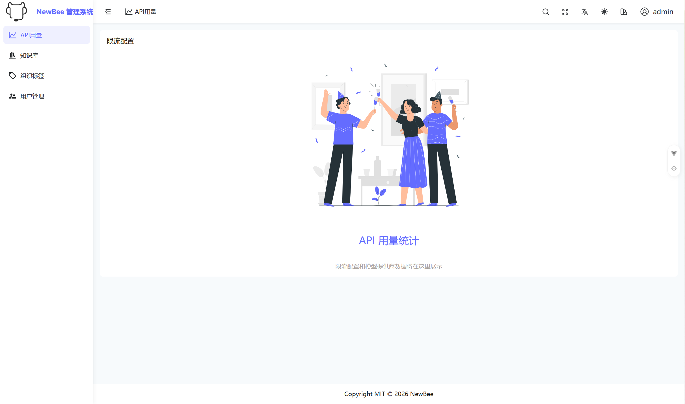
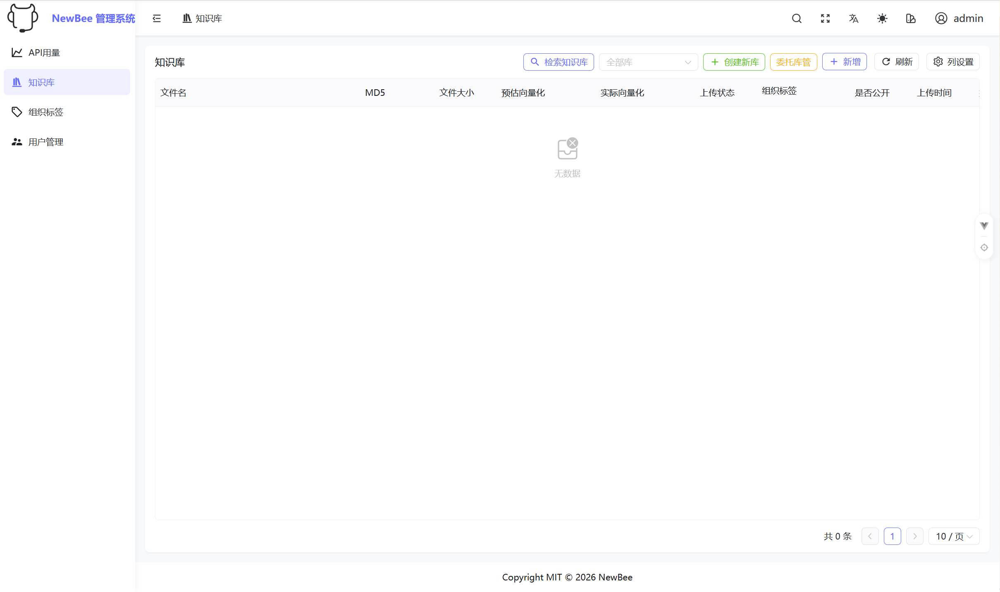
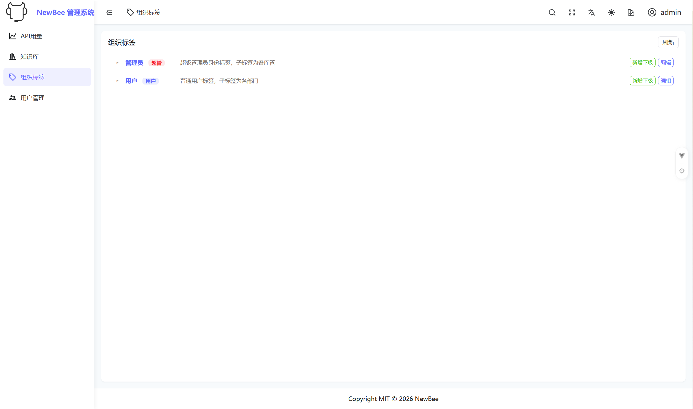
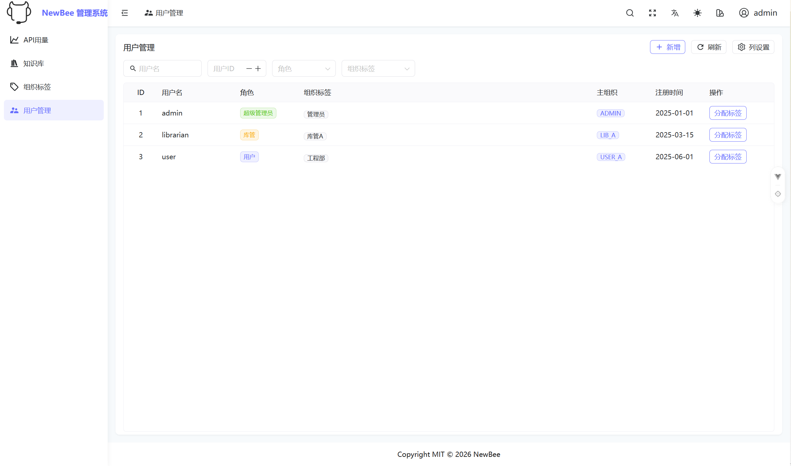

# 企业智能 RAG 问答系统 — 原型项目

> **个人独立产出** | 2026年7月
>
> 本项目原为小组协作开发，后因项目进度严重滞后且组员无意推进重构，转为个人独立完成。
> 以下介绍聚焦于本人在该项目中的实际工作与贡献。

---

## 一、项目简介

本项目是一个面向企业知识管理场景的 **RAG（Retrieval-Augmented Generation，检索增强生成）智能问答系统**。系统从企业知识库中检索与用户问题相关的内容，结合大语言模型（LLM）生成可追溯来源的高质量回答，适用于企业内部知识查询、客服辅助、制度问答等场景。

### 核心技术栈

| 层级 | 技术 |
|------|------|
| 前端 | Vue 3 + TypeScript + Naive UI + ECharts + Vite |
| 后端 | Java 17 + Spring Boot 3.5.x + Maven |
| 检索引擎 | Elasticsearch（KNN 向量检索 + BM25 关键词检索混合） |
| 消息队列 | Kafka（文件异步处理链路） |
| 对象存储 | MinIO（文档分片上传） |
| 实时通信 | WebSocket（流式对话） |

### 系统架构

```
用户浏览器
    │
    ▼
┌──────────────┐     ┌──────────────────────────────────┐
│   Vue3 前端   │────▶│  Spring Boot 后端 (/api/v1)       │
│  (Vite 构建)  │     │                                  │
└──────────────┘     │  ┌────────────┐ ┌─────────────┐  │
                     │  │ Auth 认证   │ │ 文档管理     │  │
                     │  ├────────────┤ ├─────────────┤  │
                     │  │ 用户管理    │ │ 上传服务     │  │
                     │  ├────────────┤ ├─────────────┤  │
                     │  │ 组织标签    │ │ 混合检索     │  │
                     │  ├────────────┤ ├─────────────┤  │
                     │  │ 用户监控    │ │ 仪表盘统计   │  │
                     │  └────────────┘ └─────────────┘  │
                     │          │           │           │
                     └──────────┼───────────┼───────────┘
                                │           │
                    ┌───────────▼───┐  ┌────▼──────────┐
                    │ Elasticsearch │  │  Kafka + MinIO │
                    │ (向量+关键词)  │  │ (异步文件处理)  │
                    └───────────────┘  └───────────────┘
```

---

## 二、我的工作概览

### 2.1 前端开发（主要贡献）

前端共 7 个功能页面，本人独立完成 **5 个页面的编写**（聊天页、聊天记录页、知识库页、用户监控页、API 用量页），涵盖约 90% 的前端功能代码。

### 2.2 后端开发

对后端进行了实质性改动，包括：
- 引入 `LIBRARY_ADMIN`（库管）中间角色，构建三角色权限模型
- 新增 `UserMonitorController`、`DashboardController` 两个控制器（共 6 个 API 端点）
- ES 索引隔离改造（支持按部门创建独立索引）
- 新增 `kb_tag_access` 知识库-标签权限映射表及配套 Service/Repository

### 2.3 架构设计

独立设计了 **v2.0 前后端全面重构方案**（见 `.claude.md`），涵盖角色化路由、标签驱动的权限模型、ES 索引级隔离、知识库多对多访问控制等核心架构设计。

---

## 三、核心贡献详解

### 3.1 角色化路由与权限体系

设计了 **ADMIN → LIBRARY_ADMIN → USER** 三级角色模型，并完整实现到前端路由系统：

| 角色 | 可见菜单 | 核心能力 |
|------|---------|---------|
| **ADMIN**（超级管理员） | 知识库、组织标签、用户监控、API 用量 | 管理标签树、监控全员、查看用量仪表盘 |
| **LIBRARY_ADMIN**（库管） | 聊天、知识库、聊天记录 | 管理所属知识库文档、授权用户访问 |
| **USER**（普通用户） | 聊天、聊天记录 | 检索被授权的知识库、查看自己的聊天历史 |

**实现要点：**
- 路由 `meta.roles` 元数据驱动菜单动态过滤
- 路由守卫拦截越权访问（非授权角色访问 ADMIN 路由 → 403）
- Naive UI 侧边栏根据角色自动渲染对应菜单项
- 上传按钮、文件管理操作等 UI 元素按角色显隐

### 3.2 三个新增页面

| 页面 | 路径 | 权限 | 功能描述 |
|------|------|------|---------|
| **用户监控** | `/user-monitor` | ADMIN | 全员用户列表（含对话数、Token 用量、最后活跃时间），支持展开查看用户聊天记录和 Token 明细 |
| **API 用量** | `/api-usage` | ADMIN | 统计卡片 + ECharts 趋势图 + 用户用量排行表 + 配额告警 |
| **聊天记录** | `/chat-history` | USER / LIBRARY_ADMIN | 会话列表 + 对话详情面板，支持搜索和日期筛选，对接已有 API |

### 3.3 知识库页面权限适配

对知识库页面进行了角色感知改造：
- **LIBRARY_ADMIN**：上传时 `orgTag` 自动绑定到所管理的库标签，仅显示自己库的文档
- **USER**：隐藏上传按钮，仅检索被授权的库，显示只读文档列表
- **ADMIN**：显示全部库的文档，可管理所有文件
- `canManageFile()` 权限判断从硬编码 ADMIN 检查重构为角色驱动逻辑

### 3.4 类型系统升级

- `UserInfo.role` 类型从 `'USER' | 'ADMIN'` 扩展为 `'USER' | 'LIBRARY_ADMIN' | 'ADMIN'`
- Auth Store 新增 `isLibraryAdmin` 计算属性
- 超管角色环境变量 `VITE_STATIC_SUPER_ROLE` 修正为 `ADMIN`

### 3.5 后端改动

#### 新增文件（6 个）

| 文件 | 说明 |
|------|------|
| `controller/UserMonitorController.java` | 用户监控控制器（3 个端点：监控列表 / 对话记录 / Token 明细） |
| `controller/DashboardController.java` | API 用量仪表盘控制器（3 个端点：用量摘要 / 排行 / 告警） |
| `model/KbTagAccess.java` | 知识库-标签访问映射 JPA 实体 |
| `repository/KbTagAccessRepository.java` | 知识库-标签映射 Repository |
| `service/KbTagAccessService.java` | 知识库-标签权限映射服务（授权 / 撤销 / 权限继承计算） |
| `REFACTOR_BACKEND_CHANGELOG.md` | 后端变更记录文档 |

#### 修改文件（7 个）

| 文件 | 改动要点 |
|------|---------|
| `model/User.java` | `Role` 枚举新增 `LIBRARY_ADMIN` |
| `controller/AdminController.java` | 新增 `validateAdminOrLibraryAdmin()` 权限检查方法；支持创建时指定角色 |
| `controller/DocumentController.java` | 3 处权限检查从仅 ADMIN 扩展为 ADMIN + LIBRARY_ADMIN |
| `service/UserService.java` | `createAdminUser()` 新增接受 `Role` 参数的重载方法 |
| `service/ElasticsearchService.java` | 3 个核心方法新增 `indexName` 参数重载（支持索引级隔离） |
| `service/HybridSearchService.java` | 新增 `searchAcrossIndices()` 多索引搜索方法 |

### 3.6 知识库-标签多对多权限模型

设计了 `kb_tag_access` 表驱动的知识库访问权限体系：

```
USER 树标签 ──(kb_tag_access 映射)──▶ 知识库（ES 索引）

权限继承规则：父标签获得授权 → 所有子标签自动继承访问权限
用户可访问的知识库 = 用户所有标签映射知识库的并集（含子标签继承）
```

### 3.7 重构方案设计（.claude.md）

独立撰写了 **v2.0 前后端全面重构方案**，核心设计包括：

- **标签树分离**：ADMIN 树和 USER 树完全独立，角色通过标签向上追溯判定
- **ES 索引级隔离**：一个部门 = 一个 ES 索引，替代原单索引混合存储方案
- **向量库生命周期管理**：创建/删除向量库时原子执行 ES 索引操作 + 标签创建/清理
- **7 阶段实施计划**：按优先级排序，覆盖 Controller 补全、权限模型、ES 改造、Kafka Consumer、前端路由改造、联调测试

---

## 四、项目文件结构

```
Prototype/
├── .claude.md                          # v2.0 重构方案（本人设计）
├── README.md                           # 本文件
├── frontend/                           # 前端（Vue 3 子模块）
│   ├── src/
│   │   ├── views/
│   │   │   ├── chats/                  # 聊天页（本人编写）
│   │   │   ├── chat-history/           # 聊天记录页（本人新增）
│   │   │   ├── knowledge-base/         # 知识库页（本人编写 + 权限适配）
│   │   │   ├── user-monitor/           # 用户监控页（本人新增）
│   │   │   ├── api-usage/              # API 用量页（本人新增）
│   │   │   ├── org-tag/                # 组织标签页（本人编写）
│   │   │   └── _builtin/login/         # 登录页（组员编写）
│   │   ├── router/                     # 路由系统（角色化改造）
│   │   ├── store/                      # 状态管理（新增 isLibraryAdmin）
│   │   ├── typings/                    # 类型定义（新增 LIBRARY_ADMIN）
│   │   └── locales/                    # 国际化（新增 3 个页面翻译）
│   ├── REFACTOR_BACKEND_API_NEEDS.md   # 后端 API 需求文档（本人撰写）
│   └── REFACTOR_FRONTEND_CHANGELOG.md  # 前端变更记录（本人撰写）
├── backend/                            # 后端（Spring Boot 子模块）
│   ├── controller/
│   │   ├── UserMonitorController.java  # 用户监控控制器（本人新增）
│   │   └── DashboardController.java    # 仪表盘控制器（本人新增）
│   ├── model/
│   │   ├── User.java                   # 用户模型（本人修改：新增 LIBRARY_ADMIN）
│   │   └── KbTagAccess.java           # 知识库-标签映射实体（本人新增）
│   ├── service/
│   │   ├── KbTagAccessService.java     # 权限映射服务（本人新增）
│   │   ├── ElasticsearchService.java   # ES 服务（本人修改：索引隔离）
│   │   └── HybridSearchService.java    # 混合检索（本人修改：多索引搜索）
│   └── REFACTOR_BACKEND_CHANGELOG.md   # 后端变更记录（本人撰写）
├── backend-功能实现分析.md              # 后端功能分析文档（本人撰写）
├── knowledge-base-api-analysis.md      # 知识库 API 分析文档（本人撰写）
└── 2026-06-30-修复Chat新对话消息显示与滚动异常.md  # Bug 修复记录（本人撰写）
```

---

## 五、验证结果

| 验证项 | 结果 |
|--------|------|
| TypeScript 编译（`tsc --noEmit`） | ✅ 零新增错误 |
| Vite 生产构建（`pnpm build`） | ✅ 构建成功 |
| 后端编译（`mvn compile`） | ✅ 零编译错误 |
| 后端测试（`mvn test`） | ✅ 通过 |
| 角色路由过滤 | ✅ ADMIN / LIBRARY_ADMIN / USER 各看到正确菜单 |
| 路由守卫拦截 | ✅ 越权访问 → 403 |

---

## 六、工作背景说明

本项目原为 5 人小组协作开发，原定分工为：
- 前端（2 人）：本人负责聊天页、聊天记录页、知识库页
- 后端（3 人）

实际执行中遇到的问题：
1. 前端协作困难，组员代码迟迟未能合入，进度严重阻塞
2. 后端主要负责人请假，前后端对接受阻
3. 中期检查临近，原定分工难以按期交付

在此情况下，本人承担了以下额外工作：
- 独立完成原定由两人分担的前端开发（除登录页外的全部页面）
- 对后端进行实质性改动以支持新的角色和权限模型
- 设计并实施前后端重构方案，产出可运行的改进版本

重构方案未获小组采纳的原因主要是时间紧张、临近截止日期，小组决定维持现有版本提交。

## 七、demo运行截图
 



